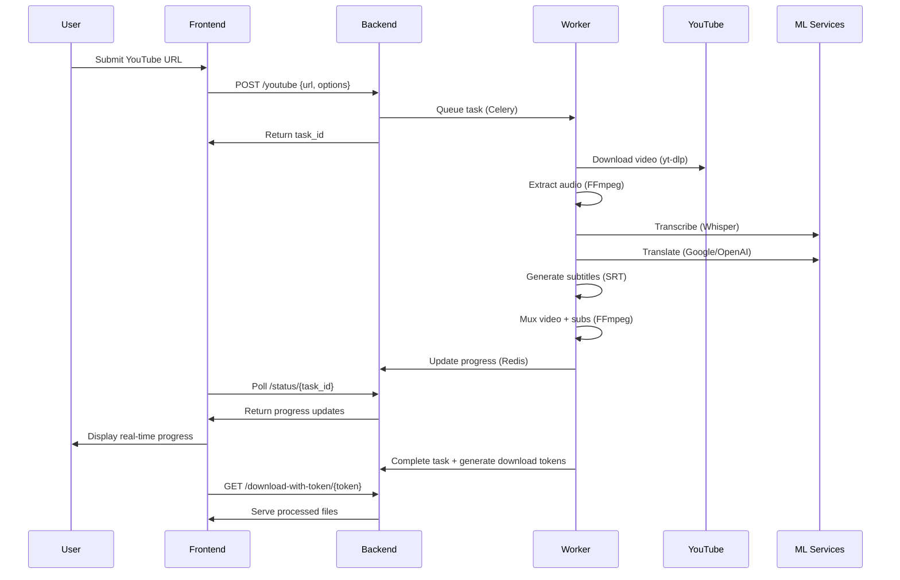

# SubsTranslator - System Architecture

## Executive Summary

SubsTranslator is an AI-powered video subtitle generation and translation platform that transforms video content into multilingual, accessible media. The system accepts YouTube URLs or uploaded video files, transcribes audio using OpenAI's Whisper models, translates subtitles into target languages, and produces both standalone SRT files and videos with embedded subtitles. Built for enterprise scale with React/TypeScript frontend, Flask API backend, and Celery worker architecture, it delivers production-grade performance with sophisticated Hebrew/RTL text support and intelligent resource management.

**Core User Flow**: Upload/YouTube URL → Video Download → Audio Extraction → Whisper Transcription → Translation → Subtitle Generation → Video Muxing → Download Artifacts

## System Context Diagram

```
┌─────────────────┐    ┌─────────────────┐    ┌─────────────────┐
│   End Users     │    │   External      │    │   ML Services   │
│                 │    │   Services      │    │                 │
│ • Browser UI    │    │ • YouTube API   │    │ • Whisper Models│
│ • Mobile Web    │    │ • Google Trans │    │ • OpenAI API    │
│ • API Clients   │    │ • CDN Content   │    │ • Translation   │
└─────────┬───────┘    └─────────┬───────┘    └─────────┬───────┘
          │                      │                      │
          │ HTTPS                │ HTTPS                │ HTTPS
          ▼                      ▼                      ▼
┌─────────────────┐    ┌─────────────────┐    ┌─────────────────┐
│   Frontend      │    │   Backend       │    │   Workers       │
│   (React/TS)    │◄──►│   (Flask)       │◄──►│   (Celery)      │
│                 │    │                 │    │                 │
│ • Nginx:80      │    │ • API:8081      │    │ • Processing Q  │
│ • Static Assets │    │ • Health/Metrics│    │ • Cleanup Q     │
│ • Routing/i18n  │    │ • File Upload   │    │ • Beat Schedule │
└─────────────────┘    └─────────────────┘    └─────────┬───────┘
                                 │                      │
                                 │ TCP                  │ TCP
                                 ▼                      ▼
                       ┌─────────────────┐    ┌─────────────────┐
                       │     Redis       │    │  File Storage   │
                       │   (Message      │    │                 │
                       │    Broker)      │    │ • uploads/      │
                       │ • Task Queue    │    │ • downloads/    │
                       │ • Results Cache │    │ • models/       │
                       │ • Port 6379     │    │ • assets/       │
                       └─────────────────┘    └─────────────────┘
                                 │
                                 ▼
                       ┌─────────────────┐
                       │  External Tools │
                       │                 │
                       │ • yt-dlp        │
                       │ • FFmpeg        │
                       │ • faster-whisper│
                       └─────────────────┘
```

## Component Architecture

### Frontend Layer (React/TypeScript)

**Core Structure** (`frontend/src/`):
```typescript
App.tsx                    // Main application component
├── hooks/useApi.ts        // Centralized backend communication
├── contexts/AuthContext   // Authentication state management
├── i18n/I18nProvider     // Internationalization wrapper
├── components/           // Reusable UI components
│   ├── UploadForm       // File upload interface
│   ├── YoutubeForm      // URL input interface  
│   ├── ProgressDisplay  // Real-time processing status
│   └── ResultsDisplay   // Download links and metadata
└── routing/LanguageRouter // URL-based language routing
```

**Key Patterns**:
- **Hook-based Architecture**: `useApi.ts` centralizes all backend communication with polling-based progress updates
- **Context Providers**: AuthContext + I18nProvider for cross-component state
- **Error Boundaries**: Structured error handling with i18n error messages
- **RTL Support**: Full Hebrew/Arabic layout with CSS logical properties

### Backend Layer (Flask API)

**Module Structure** (`backend/`):
```python
app.py                     // Flask application + API endpoints
├── config.py             // Environment-based configuration
├── core/exceptions.py    // Structured error hierarchy
├── services/            // Business logic layer
│   └── subtitle_service // SRT processing and validation
├── i18n/translations    // Backend i18n support
├── state_manager.py     // Thread-safe task state tracking
└── logging_config.py    // Structured logging with context
```

**API Design Principles**:
- **RESTful Endpoints**: `/youtube`, `/upload`, `/status/{id}`, `/download/{token}`
- **Structured Responses**: Consistent error/success formats with i18n messages
- **Input Validation**: File type/size limits, URL validation, parameter sanitization
- **Error Handling**: Custom exception hierarchy with user-facing translations

### Workers Layer (Celery)

**Task Architecture** (`backend/tasks.py`, `celery_config.py`):
```python
# Task Graph Structure
download_and_process_youtube_task()
├── 1. Video Download (yt-dlp)
├── 2. Audio Extraction (FFmpeg)  
├── 3. Transcription (Whisper)
├── 4. Translation (Google/OpenAI)
├── 5. Subtitle Generation (SRT)
└── 6. Video Muxing (FFmpeg)

# Queue Architecture
processing_queue          // Main processing tasks
cleanup_queue            // File lifecycle management
default_queue            // System tasks
```

**Design Features**:
- **Idempotent Tasks**: All operations support retries without side effects
- **Progress Tracking**: 6-step FSM with weighted progress calculation
- **Resource Management**: `max-tasks-per-child=1` prevents memory leaks
- **Timeout Protection**: 30min soft limit, 35min hard limit

### Shared Configuration

**Environment Strategy** (`config.py`, `shared_config.py`):
```python
# Configuration Hierarchy
DevelopmentConfig   // Local development settings
ProductionConfig    // Production hardening
TestingConfig      // CI/testing overrides

# Shared Language Data
SUPPORTED_LANGUAGES    // UI languages (he, en, es, ar)
TRANSCRIPTION_LANGUAGES // Extended set for ML processing
```

**Security Model**:
- ✅ Environment variables for all secrets
- ✅ No hardcoded credentials in codebase
- ✅ Secure file handling with path traversal protection

## Data Flow & Processing Pipeline

### YouTube URL Processing Sequence

```
User Input (YouTube URL) → Frontend Validation → Backend API Call
                                                       ↓
Task Creation (Celery) → Redis Queue → Worker Pickup
                                          ↓
Step 1: yt-dlp Download → Temp Storage (/app/uploads)
                             ↓
Step 2: FFmpeg Audio Extract → WAV file
                                  ↓  
Step 3: Whisper Transcription → Original SRT
                                    ↓
Step 4: Google/OpenAI Translation → Translated SRT  
                                       ↓
Step 5: FFmpeg Subtitle Burn-in → Final MP4
                                    ↓
Step 6: File Organization → Downloads folder → Token-based Access
```

### Local Upload Processing Sequence

```
File Upload (multipart/form-data) → Flask Request Handler → Validation
                                                              ↓
Secure Storage (/app/uploads) → Task Queue → Worker Processing
                                               ↓
[Steps 2-6 identical to YouTube flow]
```

### State Management & Progress Tracking

**Finite State Machine** (`state_manager.py:16-50`):
```
PENDING → PROGRESS → SUCCESS
    ↓        ↓          ↑
    ↓     ERROR ────────┘
    ↓        ↓
    └──── FAILURE
```

**Progress Calculation**:
- Each step has configurable weight (download=20%, transcribe=40%, etc.)
- Real-time updates via Redis polling
- Granular sub-step progress within operations

### File Lifecycle Management

**Retention Policy**:
- **Uploads**: Deleted after successful processing or 24h timeout
- **Downloads**: Retained 24h with periodic cleanup (Celery Beat)
- **Models**: Persistent cache with intelligent eviction
- **Logs**: Structured JSON with configurable retention

## Technology Choices & Trade-offs

### Core Stack Rationale

| Technology | Choice | Pros | Cons | Alternative Considered |
|------------|--------|------|------|----------------------|
| **Frontend** | React/TypeScript | Mature ecosystem, strong typing, excellent i18n | Bundle size, complexity | Vue.js, Svelte |
| **Backend** | Flask + Gunicorn | Lightweight, flexible, Python ecosystem | Not async-native | FastAPI, Django |
| **Queue** | Celery + Redis | Battle-tested, monitoring tools | Complex setup | RQ, Dramatiq |
| **ML** | faster-whisper | 4x faster than OpenAI Whisper | GPU setup complexity | OpenAI API, AssemblyAI |
| **Video** | FFmpeg | Industry standard, comprehensive | Learning curve | GStreamer |
| **Download** | yt-dlp | Active fork, YouTube-proof | Fragile to site changes | pytube, youtube-dl |

### Performance Characteristics

**CPU Intensive Operations**:
- Whisper transcription (benefits from GPU acceleration)
- FFmpeg video encoding/muxing
- yt-dlp video download parsing

**Memory Usage Patterns**:
- Whisper models: 1-3GB depending on size (config.py:33-34)
- Video files: Temporary 2x storage during processing
- Worker processes: 4-8GB reservation per concurrent task

**I/O Bottlenecks**:
- Network: YouTube download bandwidth
- Disk: Video file read/write operations
- Redis: Task state and result storage

## Non-Functional Requirements

### Performance & Scalability

**Current Limits**:
- **Concurrent Tasks**: 1 worker (configurable to N cores)
- **File Size**: 500MB limit (config.py:28)
- **Model Selection**: Auto-scaling from tiny→large based on content
- **Processing Time**: 2-15 minutes for typical 10-minute video

**Scaling Strategy**:
```python
# Horizontal Scaling Pattern
worker_replicas = max(1, cpu_cores // 2)
memory_per_worker = "4-8GB"
queue_partitioning = ["processing", "cleanup", "priority"]
```

### Reliability & Fault Tolerance

**Error Recovery** (`core/exceptions.py`):
- **Structured Exception Hierarchy**: 15+ specific error types
- **Retry Logic**: Exponential backoff for network operations
- **Circuit Breaking**: Protection against external service failures
- **Graceful Degradation**: Fallback to smaller models on resource constraints

**Idempotency Design**:
- All tasks support safe retries via unique request IDs
- File operations use atomic moves and cleanup
- State updates are transactional through Redis

### Security Posture

**Current Protections**:
- ✅ Input validation (file types, sizes, URL patterns)
- ✅ Path traversal prevention (`secure_filename`)
- ✅ CORS configuration
- ✅ Dependency scanning in CI

**Security Roadmap**:
- 🔄 Rate limiting implementation (Flask-Limiter)
- 🔄 Authentication framework (JWT + user sessions)
- 🔄 URL allowlisting for SSRF protection
- 🔄 File content validation beyond extensions

### Observability Stack

**Current State**:
- **Logging**: Structured JSON logs via structlog (logging_config.py:40-80)
- **Health Checks**: Basic `/health` endpoint
- **Metrics**: Task completion/failure counts in Celery

**Production Requirements**:
```yaml
Metrics:     Prometheus + Grafana
Tracing:     Jaeger/Zipkin for request correlation  
Alerting:    PagerDuty/Slack integration
Dashboards:  Processing times, error rates, queue depth
```

### Internationalization Architecture

**Language Support Matrix**:
| Language | UI Translation | Transcription | Translation | RTL Support |
|----------|---------------|---------------|-------------|-------------|
| Hebrew   | ✅ Complete    | ✅ Native      | ✅ Target    | ✅ Full     |
| English  | ✅ Complete    | ✅ Native      | ✅ Source    | ❌ N/A      |
| Arabic   | ✅ Complete    | ✅ Native      | ✅ Both      | ✅ Full     |
| Spanish  | ✅ Complete    | ✅ Native      | ✅ Both      | ❌ N/A      |
| Other    | ❌ Fallback    | ✅ Extended    | ✅ ML-only   | ❌ Limited  |

**Technical Implementation**:
- **Frontend**: i18next with namespace organization (`public/locales/{lang}/{namespace}.json`)
- **Backend**: Python i18n with message catalogs (`backend/i18n/locales/`)
- **Shared Config**: Language metadata synchronization (`shared_config.py`)

## Deployment & Runtime Topology

### Docker Compose Services

| Service | Image | Port | Purpose | Resource Limits |
|---------|-------|------|---------|-----------------|
| `frontend` | nginx:alpine | 80 | Static React app serving | 512MB RAM |
| `backend` | python:3.9-slim | 8081 | Flask API server | 2GB RAM |
| `worker` | python:3.9-slim | - | Celery task processor | 8GB RAM |
| `beat` | python:3.9-slim | - | Scheduled task runner | 512MB RAM |
| `redis` | redis:alpine | 6379 | Message broker + cache | 1GB RAM |

### Network Architecture

```
Internet → [Port 80] → Frontend (Nginx) 
                        ↓ reverse proxy
                      Backend (Flask :8081)
                        ↓ task dispatch  
                      Redis (:6379) ← Worker Pool
                        ↓ results
                      File Storage (mounted volumes)
```

### Volume Strategy

```yaml
Persistent Volumes:
  ./backend/whisper_models:/app/whisper_models  # ML model cache
  ./backend/assets:/app/assets                  # Static resources

Ephemeral Volumes:  
  ./backend/uploads:/app/uploads                # Temp input files
  ./backend/downloads:/app/downloads            # Output artifacts
```

### Environment Configuration

**Development** (`docker-compose.yml`):
- Single worker instance
- Debug logging enabled
- Host volume mounts for hot reloading
- Memory limits for safety

**Production Considerations**:
```yaml
# Recommended Production Overrides
worker_replicas: 4-8                    # Based on CPU cores
memory_limits: 
  backend: 4GB
  worker: 8GB                          # For large Whisper models
  redis: 2GB                           # Queue + result storage
healthcheck_interval: 30s
restart_policy: unless-stopped
```

## API Overview

### Endpoint Categories

**Processing Endpoints**:
```http
POST /youtube              # Full YouTube processing pipeline
POST /upload               # Local file processing pipeline  
POST /download-video-only  # YouTube download without processing
POST /embed_subtitles      # Manual subtitle burn-in
```

**Status & Management**:
```http
GET  /status/{task_id}     # Real-time progress polling
GET  /download-with-token/{token}  # Secure file download
GET  /health               # Service health check
GET  /languages            # Supported language metadata
```

### Request/Response Patterns

**Standard Success Response**:
```json
{
  "task_id": "uuid-v4",
  "status": "PROGRESS|SUCCESS|FAILURE", 
  "result": {
    "files": {
      "original_srt": "filename.srt",
      "translated_srt": "filename_he.srt", 
      "video_with_subtitles": "filename_final.mp4"
    },
    "metadata": { "duration": 180, "title": "..." },
    "progress": { "overall_percent": 100, "current_step": "completed" }
  }
}
```

### Versioning Strategy

**Current State**: Unversioned API (technical debt)
**Migration Plan**: 
1. Introduce `/v1/` prefix for all endpoints
2. Maintain compatibility aliases during transition
3. Implement API deprecation headers and documentation

## Data Flow & Processing Pipeline

### YouTube Processing Sequence



### State Machine Implementation

**Task States** (`state_manager.py:16-32`):
```python
class TaskState(Enum):
    PENDING  = "PENDING"    # Queued, not started
    PROGRESS = "PROGRESS"   # Currently processing  
    SUCCESS  = "SUCCESS"    # Completed successfully
    FAILURE  = "FAILURE"    # Terminal error state

class StepStatus(Enum):
    WAITING     = "waiting"      # Step not yet started
    IN_PROGRESS = "in_progress"  # Currently executing
    COMPLETED   = "completed"    # Successfully finished
    ERROR       = "error"        # Failed with retry possibility
```

**Progress Calculation**:
```python
# Step Weights (tasks.py:748-770)
steps_config = [
    {"label": "download_video", "weight": 0.20},
    {"label": "extract_audio", "weight": 0.15}, 
    {"label": "transcribe", "weight": 0.35},
    {"label": "translate", "weight": 0.15},
    {"label": "create_video", "weight": 0.15}
]

overall_progress = sum(step.progress * step.weight for step in steps)
```

### File Lifecycle Management

**Processing Flow**:
1. **Upload** → Secure temp storage (`/app/uploads/{uuid}/`)
2. **Processing** → Worker-specific workspace  
3. **Output** → Downloads folder with cleanup timer
4. **Cleanup** → Celery Beat task every 6 hours

**Security Measures**:
- Filename sanitization (`tasks.py:43-62`)
- Path traversal prevention
- File type validation beyond extensions
- Size limits with graceful handling

## Technology Choices & Trade-offs

### ML Pipeline Decisions

**Whisper Implementation** (`whisper_smart.py`):
```python
# Model Selection Logic
def select_optimal_model(duration, language, quality_preference):
    if duration < 300:      return "tiny"    # Fast for short content
    elif language == "en":  return "medium"  # Optimized for English
    elif quality == "high": return "large"   # Best accuracy
    else:                   return "base"    # Balanced default
```

**Trade-offs**:
- **faster-whisper vs OpenAI API**: 4x faster local processing vs API rate limits
- **Model caching**: Disk space vs download time on cold starts
- **CPU vs GPU**: Broader compatibility vs performance

### Translation Architecture

**Service Abstraction** (`translation_services.py:20-100`):
```python
class TranslationService:
    def translate(text, source_lang, target_lang): pass

class GoogleTranslateService(TranslationService): 
    # Free tier, good quality, rate limited
    
class OpenAITranslateService(TranslationService):
    # API costs, excellent quality, context aware
```

### Container Strategy

**Multi-stage Build Benefits**:
- Reduced image size (Python slim base)
- Security (non-root user execution)
- Reproducible builds with locked dependencies

**Volume Mount Strategy**:
- **Development**: Host mounts for hot reloading
- **Production**: Named volumes for persistence

## Non-Functional Requirements

### Performance Profile

**Benchmarks** (typical 10-minute video):
```
Download (YouTube):    2-5 minutes  (network dependent)
Audio Extraction:      30-60 seconds (FFmpeg) 
Transcription:         3-8 minutes   (model dependent)
Translation:           30-60 seconds (API dependent)
Video Muxing:          2-4 minutes   (FFmpeg)
Total Pipeline:        8-18 minutes
```

**Resource Utilization**:
- **CPU**: Transcription (80%), Video Processing (60%)
- **Memory**: Peak 6GB during large model loading
- **Disk**: 2-3x video file size during processing
- **Network**: YouTube download bandwidth + translation API calls

### Reliability Mechanisms

**Retry Strategies** (`tasks.py:580-650`):
```python
# Network Operations
@retry(stop=stop_after_attempt(3), wait=wait_exponential(min=1, max=10))
def download_with_retry():
    pass

# Processing Operations  
@retry(stop=stop_after_attempt(2), wait=wait_fixed(5))
def process_with_fallback():
    pass
```

**Graceful Degradation**:
- Model fallback: large→medium→base→tiny on memory constraints
- Quality reduction: High→medium→low on network issues
- Service fallback: OpenAI→Google translation on quota limits

### Security Architecture

**Input Validation Framework**:
```python
# File Upload Security (app.py:400-500)
def validate_upload(file):
    check_file_extension(file.filename)     # Extension allowlist
    check_file_size(file, MAX_SIZE)         # Size limits
    check_mime_type(file)                   # Content validation
    sanitize_filename(file.filename)        # Path traversal prevention
```

**URL Validation** (Future Implementation):
```python
# SSRF Protection Strategy
ALLOWED_DOMAINS = {"youtube.com", "youtu.be", "m.youtube.com"}
def validate_url(url):
    parsed = urlparse(url)
    return parsed.hostname in ALLOWED_DOMAINS
```

## Risks & Future Work

### Current Limitations

**Immediate Risks** (Next 30 Days):
1. **No Rate Limiting**: DoS vulnerability on all endpoints
2. **Single Worker**: Processing bottleneck under load
3. **No Authentication**: Open access to compute resources
4. **Limited Monitoring**: Reactive incident response only

**Technical Debt** (Next 90 Days):
1. **API Versioning**: Breaking changes without migration path
2. **Database Layer**: File-based state limits scalability 
3. **Caching Strategy**: No CDN for static assets
4. **Error Aggregation**: Manual log analysis required

### Scaling Roadmap

**Phase 1: Production Hardening**
- Rate limiting + authentication
- Comprehensive monitoring stack
- Load testing suite
- Security audit + penetration testing

**Phase 2: Performance Optimization**
- Auto-scaling worker pools
- GPU acceleration for Whisper
- CDN integration for downloads
- Database migration for metadata

**Phase 3: Feature Enhancement** 
- Real-time processing (WebSocket updates)
- Batch processing APIs
- Advanced subtitle editing
- Multi-tenant architecture

## Directory Layout

```
SubsTranslator/
├── 🐳 Infrastructure
│   ├── docker-compose.yml       # Service orchestration
│   ├── backend.Dockerfile       # Python app container
│   ├── frontend.Dockerfile      # React app container  
│   └── nginx.conf               # Reverse proxy config
│
├── 🔧 Backend (Python/Flask)
│   ├── app.py                   # Flask application entry
│   ├── config.py                # Environment configuration
│   ├── tasks.py                 # Celery task definitions
│   ├── celery_worker.py         # Worker process entry
│   ├── core/exceptions.py       # Error handling framework
│   ├── services/                # Business logic layer
│   ├── i18n/                    # Backend internationalization
│   └── tests/                   # Unit + integration tests
│
├── 🎨 Frontend (React/TypeScript)
│   ├── src/
│   │   ├── components/          # React component library
│   │   ├── hooks/useApi.ts      # Backend communication
│   │   ├── contexts/            # Global state management
│   │   ├── i18n/                # Frontend internationalization
│   │   └── types/               # TypeScript definitions
│   ├── public/locales/          # Translation files
│   └── tests/                   # Component + E2E tests
│
├── 📚 Documentation
│   ├── ARCHITECTURE.md          # This document
│   ├── DEV_GUIDE.md            # Development workflow
│   └── PROJECT_OVERVIEW.md     # Business context
│
└── 🛠️ Operations
    ├── scripts/start.sh         # Development startup
    ├── scripts/stop.sh          # Graceful shutdown
    └── .github/workflows/       # CI/CD pipeline
```

## Glossary

**FFmpeg**: Swiss-army knife for video/audio processing. Used for audio extraction, subtitle burn-in, and video muxing.

**yt-dlp**: Python library for downloading videos from YouTube and 1000+ other sites. Active fork of youtube-dl with better reliability.

**Whisper**: OpenAI's speech-to-text model. "faster-whisper" is an optimized implementation providing 4x speed improvement.

**SRT**: SubRip Subtitle format. Plain text with timestamps: `[00:01:30 --> 00:01:35] Subtitle text here`

**Muxing**: Multiplexing - combining video, audio, and subtitle streams into a single container file.

**RTL**: Right-to-Left text direction for languages like Hebrew and Arabic, requiring special CSS and font handling.

**Celery**: Distributed task queue for Python. Handles asynchronous processing with Redis as message broker.

**State Machine**: Finite State Machine (FSM) pattern for tracking multi-step processing with progress updates and error recovery.

---

*Last Updated: 2025-08-31*  
*Document Version: 1.0*  
*Target Audience: Senior Engineers + SRE Teams*